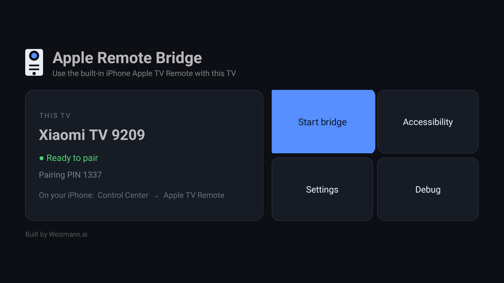
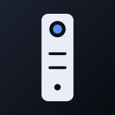
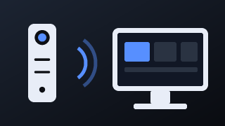

# Android Apple Remote Bridge

Use the **native Apple TV Remote built into iPhone Control Center** to connect to and control an **Android TV / Google TV** device.

Android Apple Remote Bridge makes an Android TV advertise itself as a compatible Apple Companion device, handles Apple's pairing and encrypted Companion Link session, and translates remote commands into Android TV actions.

> No separate iPhone remote app is required. Open the Apple TV Remote from iOS Control Center and connect directly to your Android TV.

<p align="center">
  
</p>

<p align="center">
  
  
</p>

<p align="center"><sub>App icon and Android TV launcher banner</sub></p>

## Status

The core Companion implementation is working:

- iPhone discovers the Android TV from the native Apple TV Remote.
- PIN pairing works.
- Pair-Setup and Pair-Verify work.
- Encrypted Companion Link sessions work.
- Pairing identity is persisted between connections.
- Touch/HID and media commands are received from iOS.
- Android Accessibility integration is available for translating remote actions.
- The Companion server runs as an Android foreground service.
- Device identity/name can be changed from the TV app.
- Built-in diagnostics and pairing trace are available from the Debug screen.

Some Android TV manufacturers handle DPAD, volume and media injection differently. Command compatibility may therefore vary by device/firmware while the Android-side control layer continues to improve.

## How it works

```text
iPhone Control Center
        │
        │  Apple TV Remote
        ▼
Apple Companion Link
        │
        │  mDNS discovery
        │  Pair-Setup / Pair-Verify
        │  encrypted transport
        │  OPACK / HID / media commands
        ▼
Android Apple Remote Bridge
        │
        ├── Foreground Companion service
        ├── Android AccessibilityService
        └── Android media / system controls
        │
        ▼
     Android TV
```

The Android TV advertises `_companion-link._tcp` over DNS-SD/mDNS with an Apple-TV-compatible Companion identity. Once paired, the iPhone establishes an encrypted session and sends the same Companion/HID events it would send to an Apple TV.

The app decodes those events and maps them to Android TV navigation and media controls.

## Installation

1. Build or install the APK on an Android TV / Google TV device.
2. Open **Android Apple Remote Bridge**.
3. Enable its Accessibility Service when prompted.
4. Start the Remote Bridge.
5. Make sure the iPhone and Android TV are on the same local network.
6. On the iPhone, open **Control Center → Apple TV Remote**.
7. Select the Android TV name shown in the list.
8. Enter the pairing PIN shown during pairing.
9. After pairing, reconnect from the native iPhone Remote normally.

## TV app

The TV interface is designed for DPAD navigation and uses a permanent dark theme.

### Home

Everything needed for normal use sits on one screen, with no scrolling: a status card
showing the Companion device name, readiness and pairing PIN, beside a four-tile grid.

- **Start bridge** / **Accessibility** / **Settings** / **Debug**
- Colour-coded readiness: green once the Accessibility service is connected, amber until then
- The pairing PIN and where to find the remote on the iPhone

New installs advertise themselves as `Android TV <number>`; the name can be changed in Settings.

### Settings

The Companion name shown on the iPhone can be changed from Settings.

Saving a new name generates a **new Companion identity**, clears the previous pairing state and restarts the bridge. The device will then appear to iOS as a new remote target and must be paired again.

### Debug & Advanced

Development and troubleshooting controls are kept out of the normal UI and remain available here:

- Pairing / Companion trace
- Last error
- Clear diagnostics
- Generate a random new identity
- Android Accessibility settings
- Remote command tests
- DPAD tests
- Volume / mute tests
- Play / Back / Home tests
- Stop bridge

## Background operation

The Companion server runs as an Android **foreground service** and uses `START_STICKY`, allowing the bridge to remain available after leaving the application. Android may recreate the service if its process is reclaimed.

Manufacturer-specific battery or background restrictions can still affect service lifetime on some devices.

## Protocol implementation

The project implements the parts of Apple's Companion ecosystem required by the iOS Remote, including:

- `_companion-link._tcp` DNS-SD advertisement
- Companion TXT identity records
- Pair-Setup
- Pair-Verify
- Persistent pairing credentials
- Encrypted Companion transport
- OPACK framing/messages
- Companion session initialization
- HID button events
- Touch session handling
- Media control events

This is an independent interoperability project and is not affiliated with or endorsed by Apple or Google.

## Compatibility

The project currently targets Android TV / Google TV with Android 10+ (`minSdk 29`).

The Companion/iPhone side is functional. Android-side navigation, volume and media behavior can differ between TV manufacturers because Android TV firmware does not expose every remote-control operation consistently to normal applications.

Testing on additional devices is welcome, especially:

- Xiaomi / Mi TV
- Google TV
- Chromecast with Google TV
- NVIDIA Shield TV
- Sony Android TV / Google TV
- TCL Android TV / Google TV
- Philips Android TV

## Building

The Companion protocol package is not checked in; CI vendors it at build time. Do the same
once before building locally, and again after any `git clean`:

```bash
./scripts/vendor-companion-protocol.sh
./gradlew assembleDebug
```

Chaquopy needs a host Python matching the configured version (3.11). It is found automatically
at the usual Homebrew locations, or point at it explicitly:

```bash
./gradlew assembleDebug -Pchaquopy.buildPython=/path/to/python3.11
```

GitHub Actions also builds APK artifacts for repository revisions.

### Releases

Tagging a commit builds a **signed** release APK and publishes it to GitHub Releases:

```bash
git tag v0.3.0
git push origin v0.3.0
```

Signing material never lives in the repository. `.github/workflows/release.yml` reads it from
the `RELEASE_KEYSTORE_BASE64`, `RELEASE_KEYSTORE_PASSWORD`, `RELEASE_KEY_ALIAS` and
`RELEASE_KEY_PASSWORD` repository secrets, and the workflow fails rather than publishing
anything unsigned. Locally, the same values come from a gitignored `keystore.properties`;
without it, release builds are simply left unsigned.

Prebuilt APKs are on the [Releases page](../../releases).

### Testing against an emulator

An Android emulator sits behind the emulator's NAT, so its mDNS advertisement never reaches
the LAN and the iPhone cannot connect to it. `scripts/emulator-companion-bridge.py` works
around both: it re-advertises the service on the real network and relays TCP into the guest
over `adb`.

## Privacy

The bridge runs locally on the Android TV and communicates with the iPhone over the local network. Pairing credentials are stored locally on the TV for reconnecting the paired remote.

## Contributing

Issues, device test results and pull requests are welcome. When reporting compatibility problems, include:

- TV manufacturer/model
- Android / Google TV version
- iOS version
- Whether discovery works
- Whether PIN pairing completes
- Whether the remote reaches the connected state
- Which navigation/media commands work or fail

Pairing traces from the built-in Debug screen are especially useful for Companion protocol issues.

## Credits

**Built by Weizmann.ai**

Companion protocol interoperability work was informed by existing open-source implementations and protocol research, including the `atvr4samsung` project.

## Disclaimer

Apple, Apple TV and iPhone are trademarks of Apple Inc. Android, Android TV and Google TV are trademarks of their respective owners. This project is not affiliated with, sponsored by, or endorsed by Apple or Google.
